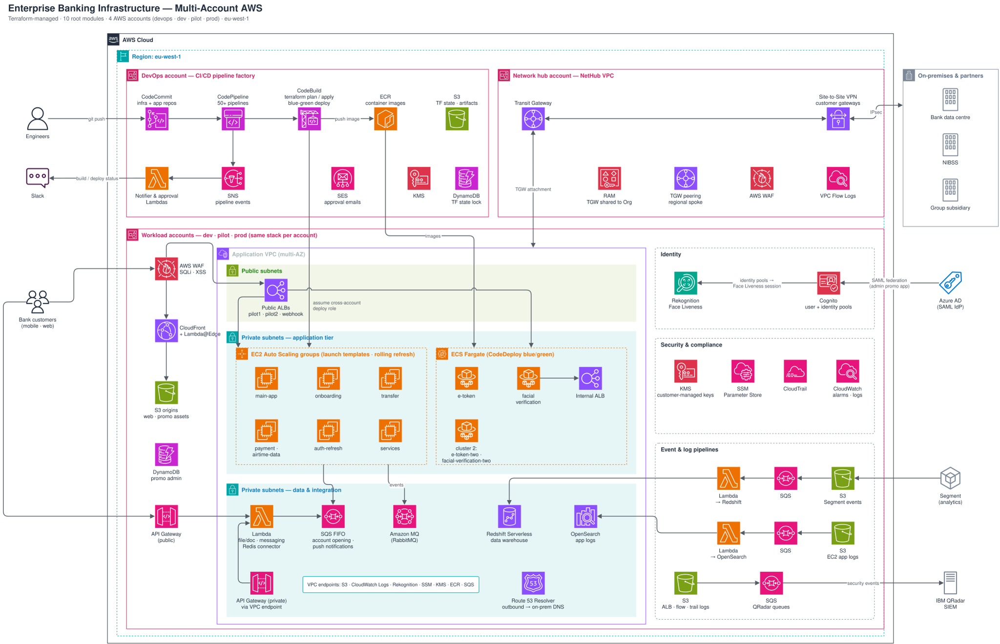
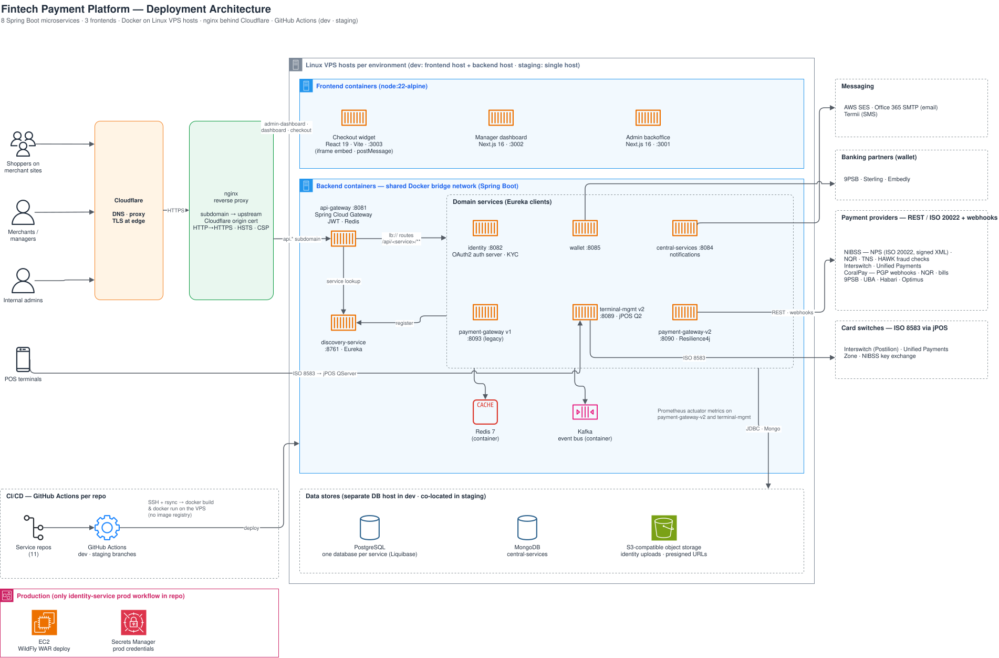
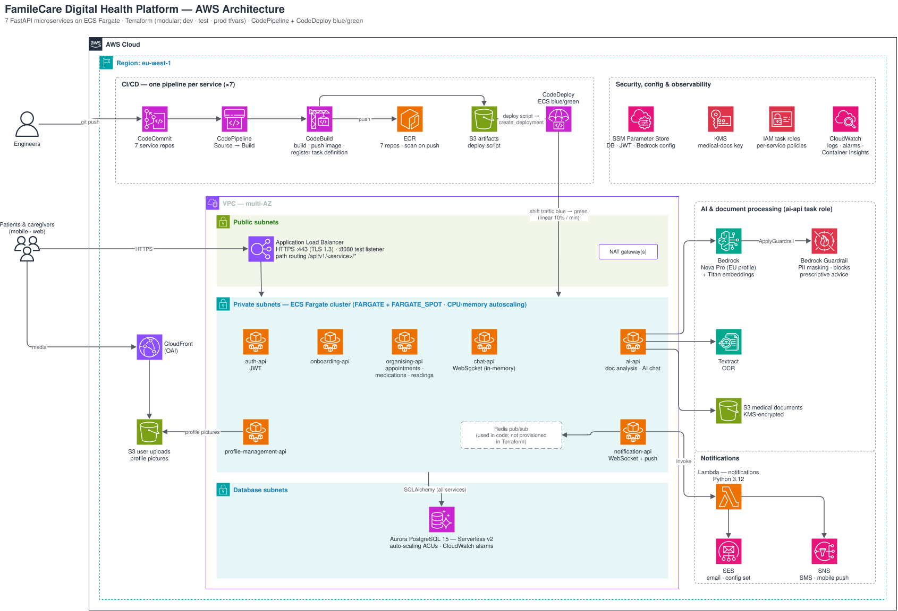
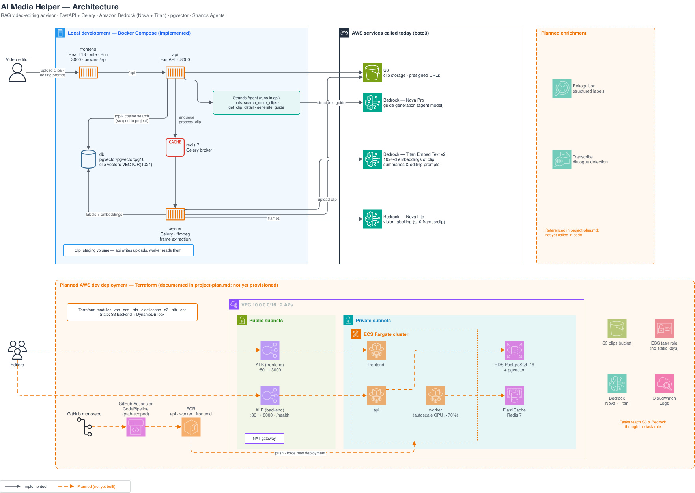
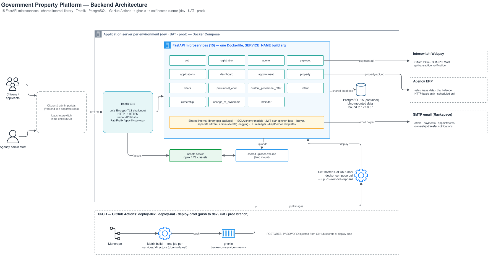
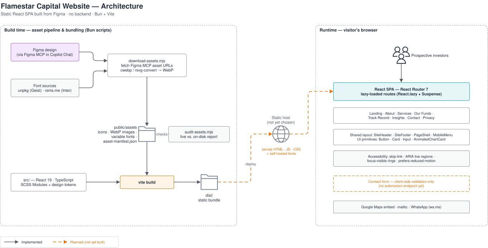
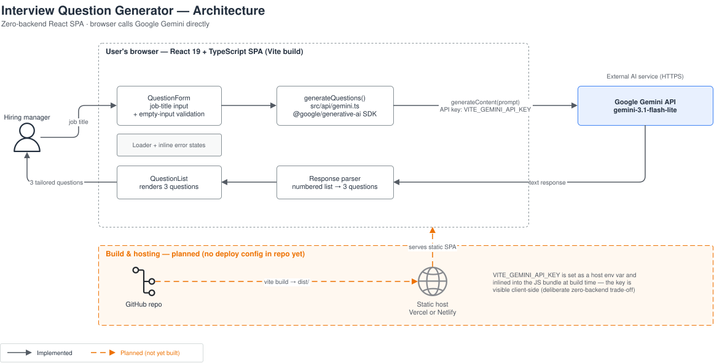

# John Olamide Alokan

## Cloud Engineer & Backend Developer — AI-Integrated Systems, Fintech & Enterprise Infrastructure

---

## Summary

I design and build cloud infrastructure, backend systems, and AI-integrated platforms for organizations that need production-grade reliability at scale — from Tier-1 banking infrastructure to healthcare platforms and applied AI tools. My work spans the full lifecycle: architecting AWS environments, provisioning infrastructure as code, building microservices, integrating LLM/AI capabilities, and shipping deployment pipelines that hold up in production.

I've worked across enterprise banking, fintech payments, digital health (FamileCare), and applied AI (AI Media Helper) — giving me a rare combination: deep cloud/infrastructure expertise paired with hands-on experience integrating AI into real backend systems.

---

## Core Competencies

- **Cloud Infrastructure & Architecture** — AWS (multi-account, VPC/networking, ECS Fargate, EC2 ASGs, API Gateway, Lambda, Cognito, WAF, CloudFront, Transit Gateway)
- **Infrastructure as Code** — Terraform (modular, multi-environment), CloudFormation
- **DevOps & CI/CD** — AWS CodePipeline, GitHub Actions, Docker, containerized deployment pipelines, zero-downtime deployment practices
- **Backend Engineering** — Python (FastAPI), Java (Spring Boot), microservices architecture, PostgreSQL/MySQL, Redis, Kafka
- **Applied AI/LLM Engineering** — Amazon Bedrock (Claude, Nova Pro), RAG pipelines with vector search (pgvector), Bedrock Guardrails, agentic workflows (AWS Strands), Google Gemini integration
- **Fintech & Payments** — ISO 8583 (jPOS), NIBSS NPS/HAWK compliance, multi-provider payment routing, multi-currency checkout systems
- **Frontend Development** — React, TypeScript, Next.js, accessibility-first design systems

---

## Roles I'm Equipped For

| Role | Backed By |
|---|---|
| **Cloud Infrastructure Engineer** | Enterprise Banking Infrastructure (multi-account AWS), FamileCare, Government Property Platform |
| **DevOps Engineer** | Fintech Payment Platform (cloud server provisioning & deployment), CI/CD pipeline design across 4+ projects |
| **Backend Engineer (Python)** | FamileCare, Government Property Platform, AI Media Helper — FastAPI microservices at scale |
| **AI/ML Integration Engineer** | AI Media Helper (RAG, agentic AI), FamileCare (Bedrock + Guardrails for healthcare) |
| **Full-Stack Engineer** | Flamestar Capital, Interview Question Generator, Fintech Payment Platform checkout widget |
| **Fintech/Payments Engineer** | Fintech Payment Platform (ISO 8583, NIBSS compliance), Enterprise Banking Infrastructure |

---

## Certifications

- [**AWS Certified Solutions Architect – Associate**](https://www.credly.com/badges/db1a9324-245c-4b9e-b10e-eafcf841df60/public_url)

- [**AWS Certified CloudOps Engineer – Associate**](https://www.credly.com/badges/0b0c0244-4dee-4b3c-b58f-36e7cae2ecb0/public_url)

- [**AWS Certified Machine Learning Engineer – Associate**](https://www.credly.com/badges/a41350c4-ad6c-4f95-8f77-73d030211859/public_url)

---

## Featured Projects

### 1. Enterprise Banking Infrastructure

**Role: Cloud Engineer — Infrastructure Creation**
Built the AWS cloud infrastructure powering the digital banking platform of a Tier-1 commercial bank. Delivered a multi-account, multi-environment architecture supporting millions of banking customers across mobile and web.

- Designed and provisioned infrastructure across **4 AWS accounts** (devops, dev, pilot, prod) using **9 independently deployable Terraform modules**
- Built networking foundation: VPC design, Transit Gateway network hub, VPC endpoints, WAF (SQL injection/XSS protection), CloudFront CDN
- Provisioned compute across both ECS Fargate (containerized services: e-token, facial verification, FX, loans) and EC2 Auto Scaling Groups (main app, onboarding, transfers, payments)
- Implemented identity and security: Cognito identity pools, Azure AD SAML federation, KMS encryption, VPC flow logs, SIEM (QRadar) integration
- Delivered a **CI/CD pipeline factory** managing 50+ CodePipeline pipelines as Terraform-managed infrastructure, with Slack notifications and approval gates for production deployments

**Tech:** AWS (ECS Fargate, EC2, API Gateway, Lambda, Cognito, WAF, CloudFront, Transit Gateway, Redshift, OpenSearch), Terraform, CodePipeline/CodeBuild

---

### 2. Fintech Payment Platform

**Role: DevOps Engineer — Cloud Server Provisioning & Deployment**
Prepared and managed the cloud server infrastructure for a fintech payment platform, ensuring seamless, reliable deployment across a fintech system spanning 8 backend microservices and 3 frontend applications.

- Provisioned and configured cloud servers to support a Spring Boot microservices backend (payment gateway, identity, wallet, terminal management, service discovery)
- Built and maintained deployment pipelines (GitHub Actions) with environment-based branch mapping (dev/staging/prod), ensuring consistent, repeatable deployments
- Set up Docker-based deployment workflows and nginx reverse proxy configuration across environments
- Supported a platform processing payments via **6 methods** (card, wallet, USSD, bank transfer, direct transfer, QR code) across **8 currencies**, compliant with NIBSS NPS/HAWK standards
- Ensured deployment reliability for a system with 257 automated tests and 75%+ statement coverage on the customer-facing checkout widget

**Tech:** Docker, nginx, GitHub Actions, Spring Boot, AWS Secrets Manager, multi-environment deployment (dev/staging/prod)

---

### 3. FamileCare — Digital Health Platform

A cloud-native healthcare platform connecting patients and caregivers via AI-powered medical document analysis, real-time chat, and health monitoring — built as 7 independent FastAPI microservices on AWS.

- Architected modular Terraform infrastructure (VPC, Aurora Serverless, ECS Fargate, ALB, CodePipeline) across dev/test/prod environments
- Integrated Amazon Bedrock (Nova Pro) with custom-tuned Guardrails for safe, compliant health AI — blocking prescriptive medical advice and anonymizing PII
- Built AI-powered medical document analysis using AWS Textract, Tesseract OCR, and Bedrock
- Implemented KMS-encrypted document storage, SSM Parameter Store secrets management, and multi-channel notifications (SES, SNS, WebSocket)

**Tech:** Python/FastAPI, AWS (Bedrock, Aurora Serverless, ECS Fargate, Textract, KMS), Terraform, AWS CodePipeline

---

### 4. AI Media Helper — AI-Powered Video Editing Advisor

An AI system that analyzes raw video footage and generates structured editing guidance using Retrieval-Augmented Generation (RAG) — bridging semantic video understanding with practical editing workflows.

- Built a RAG pipeline using Amazon Bedrock (Claude vision + Titan Embeddings) and PostgreSQL/pgvector for semantic clip search
- Designed an agentic guide-generation system using AWS Strands Agents, enabling multi-step reasoning over retrieved footage
- Architected a 5-container system (FastAPI, Celery/Redis workers, PostgreSQL, React frontend) with async video processing via ffmpeg
- Planned production AWS deployment (ECS Fargate, RDS, ElastiCache) with Terraform

**Tech:** Python/FastAPI, Celery, Amazon Bedrock, pgvector, AWS Strands Agents, React/TypeScript, Docker

---

### 5. Government Property Platform

Migrated a monolithic government property-acquisition system to a 14-service microservices architecture, digitizing citizen registration, property applications, payments, and appointment scheduling for a state government property development corporation.

- Designed a shared internal Python library used across all 14 FastAPI services for auth, logging, and database access
- Built a dynamic CI/CD pipeline (GitHub Actions) that auto-discovers services and deploys via Docker across dev/UAT/prod environments
- Integrated Interswitch payment processing and JWT-based authentication for both citizen and admin access

**Tech:** Python/FastAPI, PostgreSQL, Docker, Traefik, GitHub Actions, JWT

---

### 6. Flamestar Capital — Investment Firm Website

A production-ready, fully responsive marketing site for a Nigerian investment management firm, built pixel-faithfully from Figma to a fast, accessible React application.

- Built a custom asset pipeline (Figma sync, image optimization, asset auditing) via Node.js scripts
- Implemented accessibility best practices (skip-links, ARIA live regions, reduced-motion support) and a self-hosted variable font system for performance
- Delivered a design-token-driven SCSS system for maintainable, scalable styling

**Tech:** React 19, TypeScript, Vite, SCSS Modules, Bun

---

### 7. Interview Question Generator — AI Hiring Tool

A lightweight tool that generates tailored interview questions from a job title using Google Gemini, built to eliminate manual interview prep for hiring teams.

- Built a zero-backend architecture with direct client-to-Gemini API integration
- Designed prompt engineering and response parsing to reliably return structured, role-specific output

**Tech:** React, TypeScript, Google Gemini API, Vite

---

## Contact

[Email](olamide.alokan@gmail.com) --- [Phone Number](+2348102849867) --- [LinkedIn](https://www.linkedin.com/in/john-olamide/) --- [GitHub](https://github.com/johnolamide)
